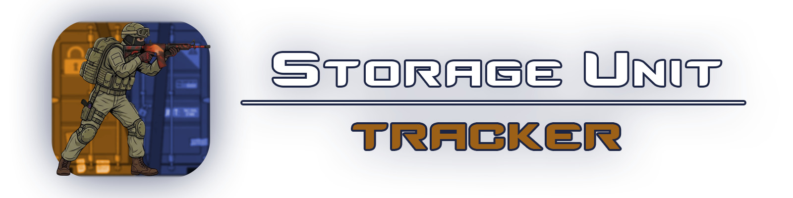
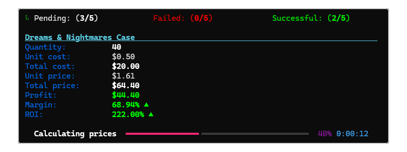
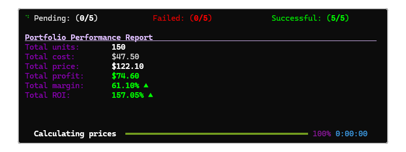

<p align="center">
  
</p>

<h1 align="center">CS2 Storage Unit Tracker</h1>

<p align="center">
  <a href="./README.md">English documentation</a>
</p>

<p align="center">
  Aplikacja CLI do śledzenia wartości rynkowej i rentowności ekwipunku Steam / CS2.
</p>

<p align="center">
  
  
  
  
  
  
  
  
  
  
</p>

---

### Informacja o znakach towarowych

_„Counter-Strike”, „Counter-Strike 2” oraz „CS2” są znakami towarowymi lub zarejestrowanymi znakami towarowymi firmy Valve Corporation. Ten projekt jest rozwijany niezależnie i nie jest powiązany z firmą Valve Corporation, przez nią sponsorowany, przez nią autoryzowany ani przez nią zatwierdzony._

---

## Przegląd

`cs2-storage-unit-tracker` to aplikacja CLI w Pythonie do synchronizacji cen przedmiotów w ekwipunku Steam. Śledzi przedmioty z ekwipunku Steam / Steam Community Market, pobiera ich aktualne ceny rynkowe i oblicza wskaźniki finansowe na podstawie skonfigurowanych danych dotyczących zakupu.

Zamiast ręcznie otwierać oferty Steam Community Market, sprawdzać ceny pojedynczo, obliczać całkowitą aktualną wartość, porównywać ją z pierwotnym kosztem zakupu i ręcznie przeliczać waluty, aplikacja automatyzuje ten proces z poziomu wiersza poleceń.

Główny proces synchronizacji weryfikuje bieżący stan, sprawdza limity żądań API, określa, które przedmioty wymagają przetworzenia, opcjonalnie pobiera kurs wymiany, pobiera ceny Steam, oblicza wskaźniki finansowe, aktualizuje stan, wyświetla postęp na żywo i generuje końcowy raport.

### Dla kogo jest ten projekt

Ten projekt jest przeznaczony dla użytkowników, którzy:

- posiadają przedmioty Steam / Counter-Strike 2
- chcą śledzić wartość rynkową swojego ekwipunku
- chcą porównywać aktualną wartość z kosztem zakupu
- chcą monitorować zysk lub stratę
- chcą zachowywać historyczne wyniki / wyniki w formie raportów
- preferują lekki workflow CLI

---

## Funkcje

- Synchronizacja cen Steam Community Market
- Śledzenie przedmiotów Steam / CS2
- Konfigurowalna liczba przedmiotów
- Konfigurowalna cena zakupu za przedmiot
- Obliczanie całkowitego kosztu ekwipunku
- Obliczanie aktualnej wartości rynkowej
- Obliczanie zysku
- Obliczenia finansowe związane z ROI
- Opcjonalne przeliczanie walut
- Integracja z kursami wymiany Frankfurter
- Wyświetlanie postępu CLI na żywo
- Trwały stan synchronizacji
- Śledzenie dziennej liczby żądań API
- Częściowa synchronizacja, gdy limit żądań jest niewystarczający
- Obsługa błędów nieudanych żądań cenowych
- Prawidłowe przerywanie za pomocą `Ctrl+C`
- Generowanie raportów tekstowych
- Obsługa ostatniego uruchomienia

---

## Jak to działa

Podczas synchronizacji aplikacja wykonuje następujący ogólny proces:

1. Wczytuje i weryfikuje bieżący stan.
2. Sprawdza, czy ostatnie uruchomienie wymaga potwierdzenia / zresetowania.
3. Resetuje liczniki żądań wraz z rozpoczęciem nowego dnia.
4. Określa liczbę dostępnych pozostałych żądań API.
5. Określa, które skonfigurowane przedmioty nadal wymagają synchronizacji.
6. Prosi o potwierdzenie, gdy możliwa jest tylko częściowa synchronizacja.
7. Pobiera kurs wymiany, gdy włączone jest przeliczanie walut.
8. Pobiera aktualne ceny Steam Community Market.
9. Oblicza wskaźniki finansowe dla poszczególnych przedmiotów.
10. Aktualizuje sumy i stan synchronizacji.
11. Wyświetla postęp na żywo w terminalu.
12. Generuje końcowy raport.
13. Zapisuje odpowiedni stan.

---

## Wymagania

- [Python](https://www.python.org/downloads/) >= 3.14

Zależności uruchomieniowe:

- [babel](https://pypi.org/project/Babel/) >= 2.18.0
- [price-parser](https://pypi.org/project/price-parser/) >= 0.5.1
- [pydantic](https://pypi.org/project/pydantic/) >= 2.13.4
- [requests](https://pypi.org/project/requests/) >= 2.34.2
- [rich](https://pypi.org/project/rich/) >= 15.0.0
- [tomli-w](https://pypi.org/project/tomli-w/) >= 1.2.0

---

## Instalacja i konfiguracja

`cs2-storage-unit-tracker` jest dystrybuowany jako pakiet Python zbudowany za pomocą [`uv_build`](https://docs.astral.sh/uv/):

```toml
[build-system]
requires = ["uv_build>=0.12.6,<0.13.0"]
build-backend = "uv_build"
```

Możesz go zainstalować i uruchomić za pomocą `uv` (zalecane) lub standardowego `pip`.

### Metoda 1: Użycie `uv` (zalecane)

`uv` to szybki, nowoczesny menedżer pakietów Python, który automatycznie obsługuje zależności i środowiska wirtualne.

**Instalacja `uv` (jeśli jest potrzebne)**

```bash
curl -LsSf https://astral.sh/uv/install.sh | sh
```

**Klonowanie i konfiguracja**

```bash
git clone https://github.com/JakubGawron/cs2-storage-unit-tracker
cd cs2-storage-unit-tracker
```

**Instalacja zależności**

```bash
uv sync
```

Instaluje to dokładne wersje zależności przypięte w [`uv.lock`](./uv.lock), zapewniając odtwarzalne środowisko.

**Uruchomienie aplikacji**

```bash
uv run cs2-storage-unit-tracker
```

**Budowanie pakietu (opcjonalne)**

```bash
uv build
```

Spowoduje to wygenerowanie plików dystrybucyjnych w katalogu `dist/`.

### Metoda 2: Użycie standardowego Pythona

**Klonowanie repozytorium**

```bash
git clone <repository-url>
cd cs2-storage-unit-tracker
```

**Utworzenie środowiska wirtualnego**

```bash
python -m venv .venv
source venv/bin/activate  # On Windows: venv\Scripts\activate
```

**Instalacja pakietu**

```bash
pip install -e .          # package only
```

Instalacja z użyciem `-e` (tryb edytowalny) tworzy połączenie z katalogiem źródłowym zamiast kopiowania plików, dzięki czemu zmiany w kodzie są natychmiast uwzględniane bez konieczności ponownej instalacji.

> **Uwaga:** Ta metoda rozwiązuje wersje zależności bezpośrednio na podstawie [`pyproject.toml`](./pyproject.toml) i nie korzysta z [`uv.lock`](./uv.lock), dlatego zainstalowane wersje mogą nieznacznie różnić się od tych z Metody 1.

**Uruchomienie aplikacji**

```bash
cs2-storage-unit-tracker
```

**Instalacja narzędzi do budowania i budowanie (opcjonalne)**

```bash
pip install build
python -m build
```

---

## Konfiguracja

Projekt ma dwa główne obszary konfiguracji:

```text
settings/
├── portfolio.toml
└── settings.toml
```

- [`settings.toml`](./settings/settings.toml) — API Steam, przeliczanie walut, formatowanie i ogólne zachowanie.
- [`portfolio.toml`](./settings/portfolio.toml) — lista posiadanych przedmiotów Steam, które mają być śledzone.

### Ustawienia

[`settings/settings.toml`](./settings/settings.toml)

```toml
[steam_api]

# Steam game app ID to track prices for.
#
# Find app ID at:
# https://steamdb.info/
#
# Default Counter-Strike 2 (app ID: 730)
#
# WARNING: App ID correctness is NOT validated at runtime.
# Invalid app ID may cause failed requests to Steam API.
#
app_id = 730

# Currency used by Steam API when retrieving prices (ISO code).
currency = "USD"


[frankfurter_api]

# Currency to convert prices into (ISO code).
# If empty, currency conversion is disabled.
to_currency = ""


[formatting]

# Controls how currency values are displayed.
#
# true:
# Use locale-aware formatting with localized currency symbols,
# decimal separators, thousands separators, and currency placement.
#
# false:
# Use a consistent format regardless of the user's locale.
#
# Example:
# 1.234,56 €
#
source_currency_use_locale = true
exchanged_currency_use_locale = true


[general]

# Number of hours after which a reset is required.
# Minimum is 6.
reset_after_hours = 24
```

#### `[steam_api]`

| Ustawienie | Wymagane | Opis                                                                                                                                                                                                                                                                                                                | Przykład |
| ---------- | -------- | ------------------------------------------------------------------------------------------------------------------------------------------------------------------------------------------------------------------------------------------------------------------------------------------------------------------- | -------- |
| `app_id`   | Tak      | Identyfikator aplikacji gry Steam używany do śledzenia cen. Domyślnie jest to `730` (Counter-Strike 2). Identyfikatory aplikacji można znaleźć na [SteamDB](https://steamdb.info/). Poprawność App ID **nie jest sprawdzana w czasie działania** — nieprawidłowa wartość może powodować nieudane żądania Steam API. | `730`    |
| `currency` | Tak      | Waluta używana przez Steam API podczas pobierania cen, jako kod waluty ISO.                                                                                                                                                                                                                                         | `"USD"`  |

#### `[frankfurter_api]`

| Ustawienie    | Wymagane | Opis                                                                                                 | Przykład |
| ------------- | -------- | ---------------------------------------------------------------------------------------------------- | -------- |
| `to_currency` | Tak      | Docelowa waluta przeliczenia, jako kod waluty ISO. Pozostaw puste (`""`), aby wyłączyć przeliczanie. | `"EUR"`  |

```toml
# Enable conversion
to_currency = "EUR"

# Disable conversion
to_currency = ""
```

#### `[formatting]`

| Ustawienie                      | Wymagane | Opis                                                                                                                                                                                                                                    | Przykład |
| ------------------------------- | -------- | --------------------------------------------------------------------------------------------------------------------------------------------------------------------------------------------------------------------------------------- | -------- |
| `source_currency_use_locale`    | Tak      | Kontroluje formatowanie wartości w walucie źródłowej zależne od ustawień regionalnych (zlokalizowane symbole, separatory dziesiętne / tysięcy, położenie waluty), gdy wartość wynosi `true`; przy `false` stosowany jest spójny format. | `true`   |
| `exchanged_currency_use_locale` | Tak      | To samo co powyżej, ale stosowane do wartości w przeliczonej walucie.                                                                                                                                                                   | `true`   |

#### `[general]`

| Ustawienie          | Wymagane | Opis                                                                            | Przykład |
| ------------------- | -------- | ------------------------------------------------------------------------------- | -------- |
| `reset_after_hours` | Tak      | Liczba godzin, po których wymagane jest zresetowanie. Minimalna wartość to `6`. | `24`     |

---

## Konfiguracja portfela

[`settings/portfolio.toml`](./settings/portfolio.toml) definiuje, które przedmioty Steam są śledzone.

```toml
["Fracture Case"]
link = "https://steamcommunity.com/market/listings/730/Fracture%20Case"
quantity = 50
purchase_price_per_item = "0.25"

["Dreams & Nightmares Case"]
link = "https://steamcommunity.com/market/listings/730/Dreams%20%26%20Nightmares%20Case"
quantity = 40
purchase_price_per_item = "0.50"

["Revolution Case"]
link = "https://steamcommunity.com/market/listings/730/Revolution%20Case"
quantity = 30
purchase_price_per_item = "0.25"

["Recoil Case"]
link = "https://steamcommunity.com/market/listings/730/Recoil%20Case"
quantity = 20
purchase_price_per_item = "0.25"

["Snakebite Case"]
link = "https://steamcommunity.com/market/listings/730/Snakebite%20Case"
quantity = 10
purchase_price_per_item = "0.25"
```

| Pole                      | Opis                                 |
| ------------------------- | ------------------------------------ |
| Item name (table header)  | Nazwa przedmiotu Steam Market        |
| `link`                    | URL oferty Steam Community Market    |
| `quantity`                | Liczba posiadanych sztuk             |
| `purchase_price_per_item` | Pierwotny koszt zakupu jednej sztuki |

> **Uwaga:** `purchase_price_per_item` jest przechowywane jako ciąg znaków w konfiguracji TOML (np. `"0.25"`), a nie jako wartość liczbowa.

Minimalny przykład dla jednego przedmiotu:

```toml
["Example Item Name"]
link = "https://steamcommunity.com/market/listings/730/Example"
quantity = 10
purchase_price_per_item = "0.25"
```

---

## Użycie

Główny plik wykonywalny to:

```bash
cs2-storage-unit-tracker
```

### Szybki start

```text
1. Zainstaluj aplikację.
2. Skonfiguruj ustawienia Steam API.
3. Skonfiguruj portfel.
4. Uruchom CLI.
5. Monitoruj postęp synchronizacji.
6. Przejrzyj wygenerowany raport.
```

Obecnie nie są dostępne żadne dodatkowe argumenty CLI ani podkomendy.

---

## CLI w działaniu

Podczas trwania synchronizacji CLI wyświetla przetwarzanie przedmiotów oraz status powodzenia / niepowodzenia:



Po zakończeniu synchronizacji CLI wyświetla postęp, komunikaty o statusie, informacje finansowe, interaktywne potwierdzenia tam, gdzie są wymagane, oraz informacje z końcowego zbiorczego raportu:



---

## Raporty

Na końcu procesu synchronizacji aplikacja generuje raport w formacie **.txt**, zawierający zagregowane informacje finansowe dla zsynchronizowanych przedmiotów.

- Raporty są generowane po zakończeniu procesu synchronizacji.
- Raporty mogą odzwierciedlać zarówno pomyślny, jak i nieudany wynik synchronizacji.
- Jeśli proces zostanie przerwany po przetworzeniu części przedmiotów, nadal może zostać wygenerowany **częściowy raport**.
- Raporty są przechowywane w katalogu [`reports/`](./reports/).

```text
reports/
├── .gitkeep
└── portfolio__YYYY-MM-D.txt
```

_Przykładowa nazwa pliku — rzeczywiste raporty są generowane z użyciem prawdziwej daty, np. `portfolio__1970-01-01.txt`._

---

## API / Usługi zewnętrzne

### Steam Community Market

Aplikacja korzysta z danych Steam Community Market w celu uzyskania aktualnych cen przedmiotów.

Steam game App ID oraz waluta pobierania są konfigurowalne:

```toml
[steam_api]
app_id = 730
currency = "USD"
```

### Frankfurter

Aplikacja może opcjonalnie korzystać z [Frankfurter](https://frankfurter.dev/) w celu pobierania kursów wymiany walut.

Przeliczanie walut jest włączane poprzez określenie docelowej waluty:

```toml
[frankfurter_api]
to_currency = "EUR"
```

Przeliczanie jest wyłączone, gdy wartość pozostanie pusta:

```toml
to_currency = ""
```

---

## Limity żądań i zachowanie synchronizacji

Aplikacja:

- śledzi liczbę wykorzystanych żądań
- oblicza liczbę pozostałych żądań przed synchronizacją
- wykrywa, gdy nie pozostały żadne żądania
- może przeprowadzić częściową synchronizację, gdy liczba żądań jest niewystarczająca dla każdego nieaktualnego przedmiotu
- prosi użytkownika o potwierdzenie przed wykonaniem częściowego procesu
- używa skonfigurowanego opóźnienia pomiędzy żądaniami
- zapisuje postęp, dzięki czemu stan synchronizacji może zostać zachowany
- obsługuje kontynuowanie po nieudanych żądaniach dotyczących poszczególnych przedmiotów

---

## Obsługa błędów i ograniczenia

### Obsługa błędów

Aplikacja obsługuje następujące sytuacje:

- nieudane żądania cen Steam
- nieudane żądania kursów wymiany walut
- wyczerpanie dziennego limitu żądań
- niewystarczająca liczba żądań do przeprowadzenia pełnej synchronizacji
- anulowanie przez użytkownika
- powtórne / niedawne uruchomienie
- przerwanie klawiaturowe (`Ctrl+C`)
- nieudane przetwarzanie poszczególnych przedmiotów

Niepowodzenie dotyczące pojedynczego przedmiotu nie musi zatrzymywać całego procesu synchronizacji. Po przerwaniu za pomocą `Ctrl+C` aplikacja zapisuje bieżący stan i może wygenerować częściowy raport, jeśli przetworzono już niektóre przedmioty.

### Ograniczenia

- Poprawność Steam App ID nie jest sprawdzana w czasie działania.
- Nieprawidłowy Steam App ID może powodować nieudane żądania API.
- Przeliczanie walut zależy od dostępności skonfigurowanej usługi kursów wymiany.
- Synchronizacja podlega limitom żądań aplikacji.
- Nie każdy przedmiot może zostać zsynchronizowany podczas jednego uruchomienia, jeśli pozostały limit żądań jest niewystarczający.

---

## Struktura projektu

Podstawowa architektura jest zorganizowana wokół kilku odpowiedzialności:

- **[`api/`](./src/cs2_storage_unit_tracker/api/)** — klienci usług zewnętrznych (Steam, Frankfurter).
- **[`cli/`](./src/cs2_storage_unit_tracker/cli/)** — punkt wejścia CLI, konfiguracja aplikacji ([`app.py`](./src/cs2_storage_unit_tracker/cli/app.py), [`app_factory.py`](./src/cs2_storage_unit_tracker/cli/app_factory.py)) oraz renderowanie terminala ([`content/`](./src/cs2_storage_unit_tracker/cli/content/), [`renderers/`](./src/cs2_storage_unit_tracker/cli/renderers)).
- **[`config/`](./src/cs2_storage_unit_tracker/config/)** — wczytywanie konfiguracji ([`loaders/`](./src/cs2_storage_unit_tracker/config/loaders/)) oraz modele danych / stanu ([`models/`](./src/cs2_storage_unit_tracker/config/models/)).
- **[`data/`](./src/cs2_storage_unit_tracker/data/)** — stan uruchomieniowy aplikacji i stan synchronizacji.
- **[`formatting/`](./src/cs2_storage_unit_tracker/formatting/)** — formatowanie wyświetlania walut.
- **[`helpers/`](./src/cs2_storage_unit_tracker/helpers/)** — współdzielone narzędzia (obsługa wartości dziesiętnych, typy błędów, pomocnicze funkcje Pydantic, dane statusu).

---

## Licencja

Ten projekt jest objęty licencją [PolyForm Noncommercial License 1.0.0](https://polyformproject.org/licenses/noncommercial/1.0.0).

Szczegóły znajdują się w pliku [`LICENSE`](./LICENSE).

---

## Autor / Kontakt

- **Autor:** Jakub Gawron
- **GitHub:** [github.com/JakubGawron](https://github.com/JakubGawron)
- **Repozytorium:** [github.com/JakubGawron/cs2-storage-unit-tracker](https://github.com/JakubGawron/cs2-storage-unit-tracker)
- **Kontakt:** [contact.jakub.gawron@gmail.com](mailto:contact.jakub.gawron@gmail.com)
